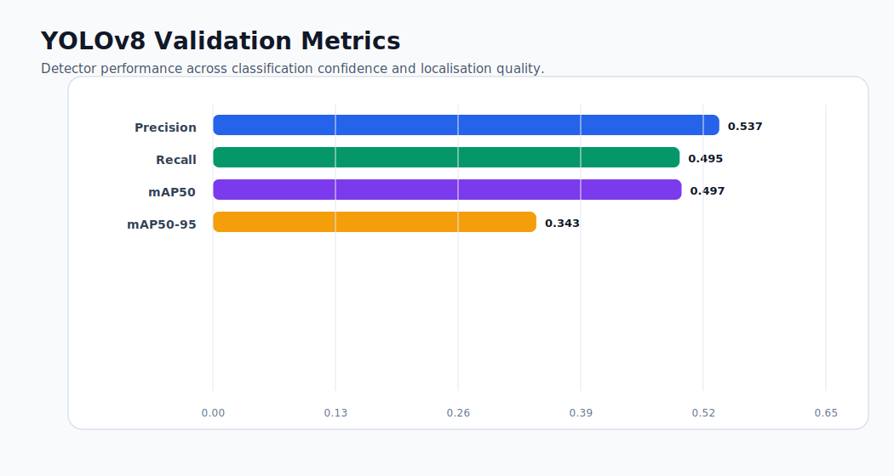
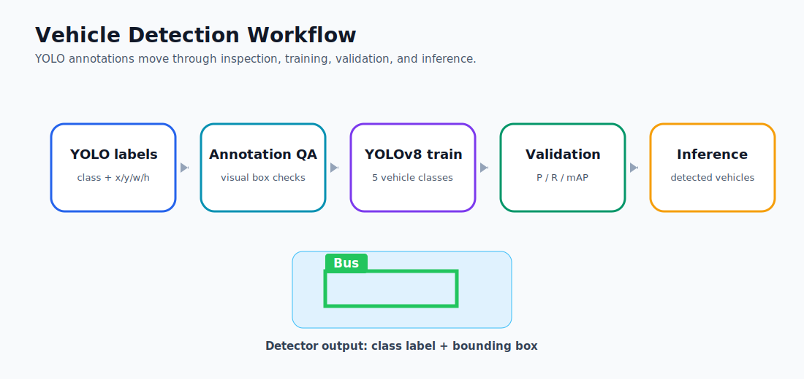
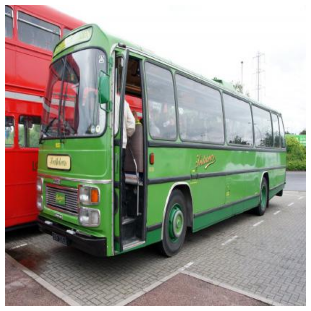

# Vehicle Detection with YOLOv8

Object-detection workflow for classifying and localising vehicles in road imagery using YOLO-format annotations and Ultralytics YOLOv8.

## Problem

Vehicle detection needs both classification and localisation: the model must identify what type of vehicle appears and where it appears in the image. This project trains a detector across five operationally useful classes.

## Classes

- Ambulance
- Bus
- Car
- Motorcycle
- Truck

## Methods

- YOLO label parsing and bounding-box conversion.
- Image and annotation visualisation with OpenCV and matplotlib.
- YOLOv8 model configuration and training.
- Validation with precision, recall, mAP50, and mAP50-95.
- Example inference on held-out test imagery.

## Results

Validation metrics from the training run:



| Metric | Value |
| --- | ---: |
| Precision | 0.537 |
| Recall | 0.495 |
| mAP50 | 0.497 |
| mAP50-95 | 0.343 |

The run establishes a full object-detection pipeline: inspect labels, train, validate, and predict. The class-level outputs are especially useful for deciding where more data or targeted augmentation would improve the detector.

## Annotation And Inference Checks





## Repository Structure

```text
.
├── notebooks/
│   └── vehicle_detection_yolov8.ipynb
├── data/
│   ├── data.yaml
│   └── README.md
├── docs/
│   └── technical_brief.md
├── requirements.txt
└── README.md
```

## Data Contract

Place YOLO-format data under:

```text
data/Cars Detection/
├── train/images
├── train/labels
├── valid/images
├── valid/labels
├── test/images
└── test/labels
```

The dataset configuration lives at `data/data.yaml`.

## Run

```bash
python -m venv .venv
source .venv/bin/activate
pip install -r requirements.txt
jupyter lab
```

Open:

```text
notebooks/vehicle_detection_yolov8.ipynb
```

## Engineering Direction

The notebook captures the experimental workflow. The deployment path is a scriptable training command, versioned model weights, exported validation plots, and a small inference wrapper for batch prediction.
